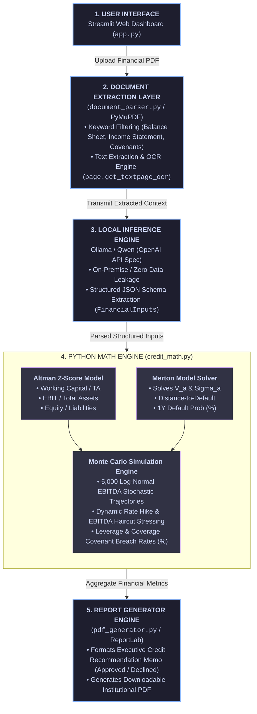

Here is a comprehensive `README.md` for your GitHub repository.

---

```markdown
# Automated Credit Risk Analyzer & Debt Covenant Stress-Tester

A privacy-first credit risk assessment and debt covenant stress-testing platform. Designed for institutional due diligence
under confidential conditions, this tool combines **on-premise quantitative extraction** with **structural credit risk models**
and **Monte Carlo cash flow simulations**—delivering bank-ready credit memoranda without transmitting sensitive borrower data
to external APIs.

---

## Technical Overview

Modern credit risk due diligence requires evaluating both **accounting insolvency risk** and **market-implied default risk**,
while stress-testing balance sheets against macroeconomic shocks (e.g., EBITDA contractions and interest rate hikes).

This platform unifies three core credit analysis paradigms:

1. **On-Premise LLM Document Parsing:** Converts raw financial PDFs, credit agreements, and audited annual reports into structured
`Pydantic` schemas using local open-weight models (via Ollama). PDF processing includes automatic fallback to PyMuPDF OCR for
 scanned documents.
2. **Structural & Statistical Credit Models:**
   * **Altman Z-Score & Z''-Score:** Measures short-to-medium term bankruptcy risk across manufacturing and non-manufacturing/private
  entities using multivariate balance sheet ratios.
   * **Merton Structural Default Model:** Solves a set of simultaneous non-linear equations using `scipy.optimize.root` to back out
  unobservable firm asset values ($\text{V}_A$) and asset volatility ($\sigma_A$) from equity market capitalization ($\text{E}$) and
  equity volatility ($\sigma_E$). Calculates distance-to-default ($\text{DD}$) and 1-year probability of default ($\text{PD}$).
3. **Monte Carlo Covenant Stress Simulation:** Runs 5,000 log-normal EBITDA path simulations to evaluate covenant breach probabilities
  (Leverage and Interest Coverage ratios) under user-defined macroeconomic shocks.

---

## Architecture Diagram

```

---

## Key Features

* **Strict Privacy & Zero Data Leakage:** Fully compatible with local Ollama deployment—ideal for confidential due diligence, M&A,
    and banking environments.
* **Smart PDF & OCR Parsing:** Intelligent keyword filtering targets relevant pages (Balance Sheets, Debt Schedules) to minimize LLM
    token usage while executing OCR on scanned pages when necessary.
* **Dynamic Macro Stress Controls:** Interactively adjust EBITDA downside haircuts ($0\% - 50\%$) and interest rate hikes
    ($0 - 500 \text{ bps}$) to observe real-time impact on covenant breach probabilities.
* **Institutional Credit Memo Generator:** Produces a downloadable, 2-page PDF Credit Memorandum complete with executive recommendations,
     metric breakdown tables, and sensitivity matrices.

---

## Project Structure

```text
├── app.py               # Streamlit web UI and orchestration logic
├── credit_math.py       # Core quantitative implementations (Altman, Merton, Monte Carlo)
├── document_parser.py   # PDF text/OCR extraction and LLM structured parsing
├── pdf_generator.py     # Institutional Credit Memorandum ReportLab PDF builder
└── requirements.txt     # System dependencies

```

---

## Prerequisites & Local Ollama Setup

### 1. Install Ollama

Ensure [Ollama](https://ollama.com/) is installed and running on your system.

### 2. Pull Recommended Extraction Model

We recommend running `qwen3.6:27b` (or `qwen2.5:14b` / `qwen2.5:7b` depending on VRAM availability):

```bash
ollama pull qwen3.6:27b

```

### 3. Verify Local API Endpoint

You can test that your local Ollama endpoint is responding to OpenAI-compatible requests with `curl`:

```bash
curl http://localhost:11434/v1/chat/completions \
  -H "Content-Type: application/json" \
  -d '{
    "model": "qwen3.6:27b",
    "messages": [
      {"role": "system", "content": "You are a financial credit analyst."},
      {"role": "user", "content": "Respond with: API connection successful."}
    ],
    "temperature": 0.0
  }'

```

---

## Linux Installation & Usage

### 1. Clone Repository & Setup Environment

```bash
git clone [https://github.com/your-username/credit-risk-covenant-tester.git](https://github.com/your-username/credit-risk-covenant-tester.git)
cd credit-risk-covenant-tester

# Create virtual environment
python3 -m venv .venv
source .venv/bin/activate

# Upgrade pip
pip install --upgrade pip

```

### 2. Install Dependencies

```bash
pip install -r requirements.txt

```

### 3. System OCR Dependency (Optional)

PyMuPDF provides integrated OCR capabilities. If system-level OCR bindings are required on Debian/Ubuntu derivatives:

```bash
sudo apt-get update && sudo apt-get install -y tesseract-ocr

```

### 4. Run Application

```bash
streamlit run app.py

```

Access the web interface at `http://localhost:8501`.

---

## Macro Stress Control Guidelines

When testing borrower stress limits in the sidebar:

| Scenario | EBITDA Haircut | Interest Rate Hike | Primary Target Use Case |
| --- | --- | --- | --- |
| **Mild Cyclical Downturn** | $10\% - 15\%$ | $+50 \text{ to } +100\text{ bps}$ | Simulates standard economic slowdown or margin compression. Checks baseline cushion. |
| **Severe Recession** | $25\% - 30\%$ | $+200 \text{ to } +250\text{ bps}$ | Tests structural resilience under demand contraction paired with elevated refinancing costs. |
| **Tail-Risk Stress** | $40\% - 50\%$ | $+400 \text{ to } +500\text{ bps}$ | Deliberately forces covenant breach to test UI alerts and Monte Carlo default tail probabilities. |

---

## License

Distributed under the MIT License. See `LICENSE` for details.

```

```
